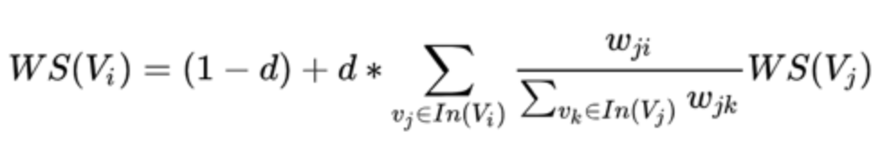

## 关键词抽取项目

### 无监督方法
#### TF-IDF算法
TF-IDF(term frequency–inverse document frequency)是一种用于信息检索与数据挖掘的常用加权技术，
常用于挖掘文章中的关键词，而且算法简单高效，常被工业用于最开始的文本数据清洗。
TF："词频"（Term Frequency，缩写为TF），
IDF："逆文档频率"（Inverse Document Frequency，缩写为IDF）。
本算法的出发点是句子中的关键词一般是在当前的doc中出现的频率比较高，但是在其他的doc中出现的频率比较低。

整个的计算步骤如下
1. 计算TF，也就是：某个词在当前doc中出现的频率
2. 计算IDF，也就是log(语料库的文档数量/(包含该词的文档数目+1))，加1是为了做平滑
3. 将TF与IDF相乘得到结果

技巧：可以将IDF提前计算出来，缓存到文件中，加快使用的速度。

#### TextRank算法
起源自大名鼎鼎的PageRank，佩奇排名本质上是一种以网页之间的超链接个数和质量作为主要因素粗略地分析网页的重要性的算法。基本的思想是一个网页被指向的越多，则其越重要。


其中d是阻尼系数，一般设置为0.85，便于快速收敛。

可以直观的理解一下PageRank算法，一个节点的Rank值是由所有指向它的节点的Rank值决定的，理论上，指向其的越多，其Rank值越高，而对于每个指向该节点的节点，其权重为链出节点数目的倒数，然后最后乘以该节点的Rank值。也就是与节点的链出数目成反比，与节点的Rank值成正比。

TextRank是PageRank在文本中的改进，算法如下图：



TextRank节点变成了每个单词，边是窗口内的词的共现关系。

将某一个词与其前面的N个词、以及后面的N个词均具有图相邻关系（类似于N-gram语法模型）

和PageRank相比，TextRank多了权重项，用来表示两个节点之间的边连接有不同的重要程度。

PageRank的权重固定是链出数目的倒数，这里是由频率计算出的权重项。

在实现的过程中，一般会设置窗口大小。

### 有监督算法

数据集： kp20k 数据集（计算机科学领域论文数据集，发表与ACL2017上）[3]
训练集：53W 条数据；验证集：2W 条数据；测试集：2W 条数据
训练数据字段：摘要、关键词、文章名
数据集样例：
```json
[{
    "abstract": "A feedback vertex set of a graph G is a set S  of its vertices such that the subgraph induced by V(G)?S V ( G ) ? S is a forest. The cardinality of a minimum feedback vertex set of G  is denoted by ?(G) ? ( G ) . A graph G is 2-degenerate  if each subgraph G? G ? of G has a vertex v  such that dG?(v)?2 d G ? ( v ) ? 2 . In this paper, we prove that ?(G)?2n/5 ? ( G ) ? 2 n / 5 for any 2-degenerate n-vertex graph G and moreover, we show that this bound is tight. As a consequence, we derive a polynomial time algorithm, which for a given 2-degenerate n -vertex graph returns its feedback vertex set of cardinality at most 2n/5 2 n / 5 .", 
    "keyword": "feedback vertex set;decycling set;2-degenerate graphs", 
    "title": "A feedback vertex set of 2-degenerate graphs"
},
{
    "abstract": "We apply the mathematics of cognitive radio to a single receiver to obtain a new coherent energy metric. This allows us to derive the time correlation law separating Gaussian colored noise from coherent signal energy.", 
    "keyword": "random matrix theory;cognitive radio;coherent energy;colored noise", 
    "title": "DETECTING COHERENT ENERGY"
}]
```


#### 模型结构
1. BERT-Finetuning

最常见的是基于BERT[2]的序列标注算法，该算法也可以应用于关键词抽取中。BERT（Bidirectional Encoder Representations from Transformers）的全称是基于 Transformer 的双向编码器表示，是谷歌在 2018 年 10 月提出的。其是由多层的 Transformer encoder 构成的，例如 BERT-base 中是有 12 层。其在大规模的无监督数据集上进行了预训练。主要的两个预训练任务有以下两个。MLM：对于输入的词语序列，BERT 随机地遮掩一些词，然后对遮掩的词做预测任务。相比于传统语言模型只能从左到右或者从右向左单向预测，MLM 可以从两个方向预测被遮掩的词语，这样的“完形填空”式的学习策略使得模型能够更多 地依赖上下文信息，赋予了模型一定的纠错能力。NSP：下一句预测任务，预测两个句子是否有上下文关系，通过句子级别的预测来增加预训练语言模型的学习能力。在使用中，我们利用 BERT 作为一个编码结构，然后在输出的时候我们对每个位置进行一个分类。具体来说，我们使用 BIO 标记体系，用 'B' 和 'I' 分别标记关键词的开始和结束位置，使用 'O' 来标记非关键词的部分。可以应用交叉熵损失函数作为 loss 来进行训练。


2. BERT2RANK[1]

由于关键词一般是一个固定长度的关键短语，可以不仅对关键词的开始和结束进行预测建模，进而我们可以转换成直接对关键短语建模，具体的方法是我们可以枚举出所有可能的关键短语（设置一个最大的窗口k），这样的时间复杂度是 O(nk) 的，其中 k 是窗口宽度，n 是句子长度。通过 BRET 编码原句子后，再通过 CNN 提取窗口的特征信息。由于关键词之间的重要程度是不一样的，因此需要对关键词之间的显著性需要进行排序，所以最终使用的是 Rank Loss，使得关键词部分的得分比非关键词要高一些。通过使用对比 loss，使模型学习区分到关键词与非关键词的特征。该种方法的优势是可以对一个 span 进行判断，相比于基于序列标注的方案，其对一个 span 进行整体的建模，更好对 span 片段的整体信息进行打分。

3. BERT-JointKPE[1]

该方法是将上述的两个方法结合起来，主要是一边利用关键词本身的信息，对关键词进行一个二分类，同时利用排序模型，将关键词与非关键词区分出来，进而对关键词的重要性进行了一个打分。该方案是一个多任务的模型，两个模型任务之间相互促进。分类任务主要是显示的判断某个句子的 span 是否为关键词信息，排序模型也相当于对关键词的显著性进行了一个打分，方便识别出具有显著意义的关键词。

#### 评价指标

主要评价指标是使用 F1 来评价。

TP: 真阳性，是关键词且模型正确预测出来
FP：假阳性，不是关键词但是模型错误的预测了出来
TN：真阴性，不是关键词且模型预测不是关键词
FN：假阴性，是关键词但是模型没有预测出来

通过以下的公式来计算 F1 得分

$P=\frac{TP}{TP+FP}$

$R=\frac{TP}{TP+FN}$

$F_{1}=\frac{2 * P * R}{P+R}$

同时，在评价的过程中，会限制一下关键词的数量。即取抽取出的关键词的 Top K 进行计算，
在这里，K 一般取 1、3、5 等，以适应不同下游任务的需要。

#### 实验结果
|序号|模型|F1 @1,@3,@5|Precision @1,@3,@5|Recall @1,@3,@5|
|:--:|:----:|:--------:|:---------------:|:------------:|
|1|Tf-Idf| ,, 0.102 | , , | , , |
|2|TextRank| ,, 0.175 | , , | , , |
|3|BERT-Finetuning|0.288, 0.402, 0.396|0.558, 0.422, 0.339 | 0.211, 0.448, 0.580|
|4|BERT2RANK|0.2961,0.4197,0.4153 |0.5674,0.4351,0.3527|0.2178,0.4704,0.6121|
|5|BERT-JointKPE|0.3065,0.4248,0.4177 |0.5879,0.4420,0.3557|0.2257,0.4753,0.6146|

可以看到，无监督的方法由于没有标注的训练数据，因此效果相比有监督的方法会差一些。有监督的模型通过引入BERT 预训练语言模型，效果得到了极大地提升，BERT 通过在大规模无监督的数据上进行预训练，学习到了大量的文本的句法或语法信息。通过引入排序的损失函数，使得模型对关键词的显著性进行打分，效果得到了一个显著的提升。将两个模型融合在一起，效果又得到了少量提升，可以看到构建的两个任务均对关键词抽取有帮助，显示了其有效性。

### 备注

无监督的关键词抽取算法由于缺少对关键词标注信息的建模，因此一般效果会比有监督的方法差一些。有监督的方法需要大量的标注数据，当标注数据不足的时候，可以采用 Tri-training 等方法进行生成，减少人工标注的压力。

### 参考文献
[1] Sun S , Xiong C , Liu Z , et al. Joint Keyphrase Chunking and Salience Ranking with BERT[J]. 2020. 

[2] Devlin  J,  Chang  M  W,  Lee  K,  et  al.  Bert:  Pre-training  of  deep  bidirectional transformers for language understanding[J]. arXiv preprint arXiv:1810.04805, 2018: 1-16.

[3] Rui Meng, Sanqiang Zhao, Shuguang Han, Daqing He, Peter Brusilovsky, and Yu Chi. 2017. Deep keyphrase generation. In Proceedings of ACL, pages 582–592.